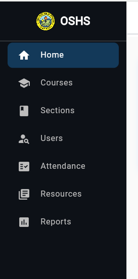
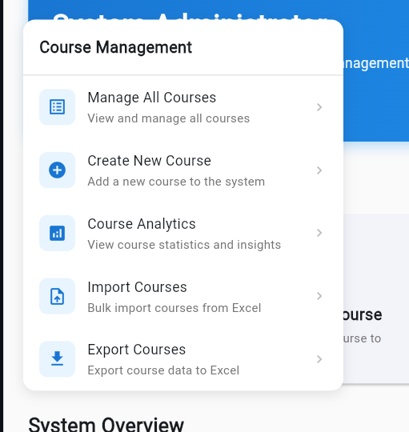

# this document aims to guide qodo gen that the programmer wants to simplify this oro high school system to the maximum simplicity and only the core features. let us start with the admin side

NOTE: THIS IS UI AND UX RELATED SO THAT WE CAN SIMPLIFY THE BACKEND INTEGRATION AND NOT COMPLICATE THINGS ANYMORE, WE WILL IMPLEMENT A SERIOUS SYSTEM CLEAN UP I THINK WE WILL REMOVE SEVERAL SCREENS AS I COMMAND.

 - In this image, this is the main sidebar of the admin side can you remove the sections and attendance? do not just remove it, also remove any related files and the states considering we are using a 4 layer architecture, also remove the screen withtin these two sidebar items. execute this first.

# cleanup #2

 - this is the course management popupmenu, i want you to remove it also, and once you remove it, perform a step by step clean up process of all the contents within it. but we will keep the courses sidebar item as we will change it.

